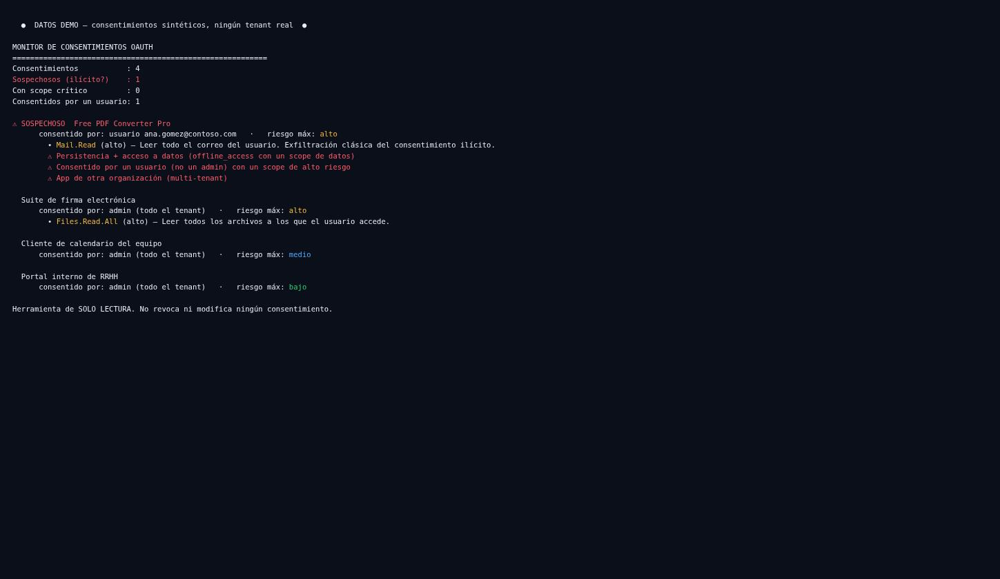

# oauth-consent-monitor

Watches the OAuth consents in a Microsoft 365 tenant and flags the ones that look like an
**illicit consent grant** — the attack where a user is tricked into consenting to a
third-party app that then reads their mail and keeps a refresh token. Read-only, and a test
enforces that.

## The problem

Illicit consent is one of the most effective attacks against M365 because it doesn't touch
a password or trip MFA. A user clicks "Accept" on a convincing-looking app, and it walks
away with `Mail.Read` and `offline_access` — the ability to read their mail and a refresh
token to keep doing it. There's no failed login, no malware, nothing for the usual alerts
to catch. Meanwhile the tenant's consent surface — every third-party and gallery app a user
or admin ever approved — grows quietly and nobody reviews the new arrivals.

## How this differs from an app-registration audit

This is **not** an audit of the app registrations you own. Its subject is the *consent
surface*: the `oauth2PermissionGrants` — what users and admins granted to apps, usually
third-party — monitored over time for new, risky consents. An over-privilege audit of your
own apps (see [entra-privilege-auditor](https://github.com/earbona23/entra-privilege-auditor))
answers a different question; this one watches the door third parties come in through.

## See it in 10 seconds — no tenant required

```bash
git clone https://github.com/earbona23/oauth-consent-monitor
cd oauth-consent-monitor
python -m monitor.cli --demo
```

Everything is `DEMO DATA`. The output puts the illicit-consent pattern first:

```
⚠ SOSPECHOSO  Free PDF Converter Pro
      consentido por: usuario ana.gomez@contoso.com   ·   riesgo máx: alto
        • Mail.Read (alto) — reads all of the user's mail. Classic illicit-consent exfiltration.
        ⚠ Persistence + data access (offline_access with a data scope)
        ⚠ Consented by a user (not an admin) with a high-risk scope
        ⚠ App from another organization (multi-tenant)
```



## Use it on a real tenant

```bash
pip install -r requirements.txt
cp config.example.yaml config.yaml
export OCM_CLIENT_SECRET=...

python -m monitor.cli --live                                  # evaluate now
python -m monitor.cli snapshot --live --salida today.json     # capture, e.g. daily
python -m monitor.cli diff yesterday.json today.json          # what got consented since
```

`diff` evaluates only the *new* consents and exits with code `3` when any of them is
suspicious — so it works as a scheduled alert (a cron or CI step) that pages you when a
risky app is newly consented, which is exactly when an illicit-consent attack shows up.

## What makes a consent "suspicious"

The tool scores each granted scope from an editable catalog
([`rules/consent_risk.yaml`](rules/consent_risk.yaml)), but the illicit-consent signal is
not any single scope — it's the **combination**:

- **Persistence + data:** `offline_access` (a refresh token) together with a data scope
  like `Mail.Read` — read the mail, and keep reading it. This pairing is the attack's
  fingerprint.
- **User consent, not admin:** a high-risk scope approved by a regular user
  (`consentType = Principal`) rather than an admin. Illicit consent targets users precisely
  because they can approve without review.
- **Another organization's app:** a multi-tenant app owned outside your tenant carrying
  high-risk scopes.

A consent is flagged `SOSPECHOSO` when it shows at least one of these signals *and* holds a
high-risk scope. A scope the catalog doesn't know is treated as `desconocido` — surfaced,
never assumed harmless.

### Permissions — read-only

`Directory.Read.All` (service principals and grants) and `User.Read.All` (to resolve who
consented). The Graph client exposes only `get()`/`get_all()`, and
`tests/test_readonly_guarantee.py` fails if a write verb appears anywhere. It reads the
consent surface; it never revokes or modifies a grant.

## Limitations

- **It flags, it doesn't revoke.** Read-only is deliberate. Revoking a consent is a
  decision with blast radius (you might break a legitimate integration); this surfaces the
  candidates for a human to act on.
- **Signals are heuristics, not verdicts.** A multi-tenant app with `Mail.Read` may be a
  sanctioned vendor. The tool ranks what deserves a look; the look is yours.
- **Coverage is delegated grants.** It reads `oauth2PermissionGrants` (delegated consent).
  Application-permission grants to service principals (`appRoleAssignments`) are a natural
  next step and are called out here rather than silently omitted.
- **`--live` is unit-tested with mocked Graph responses.** Validate against your tenant
  before relying on it.

## Contributing

New entries in the scope-risk catalog are welcome — add the scope, its level, and the
reason. Keep collectors read-only. Run `pytest -q` and `ruff check .`.

## License

MIT — see [LICENSE](LICENSE).
